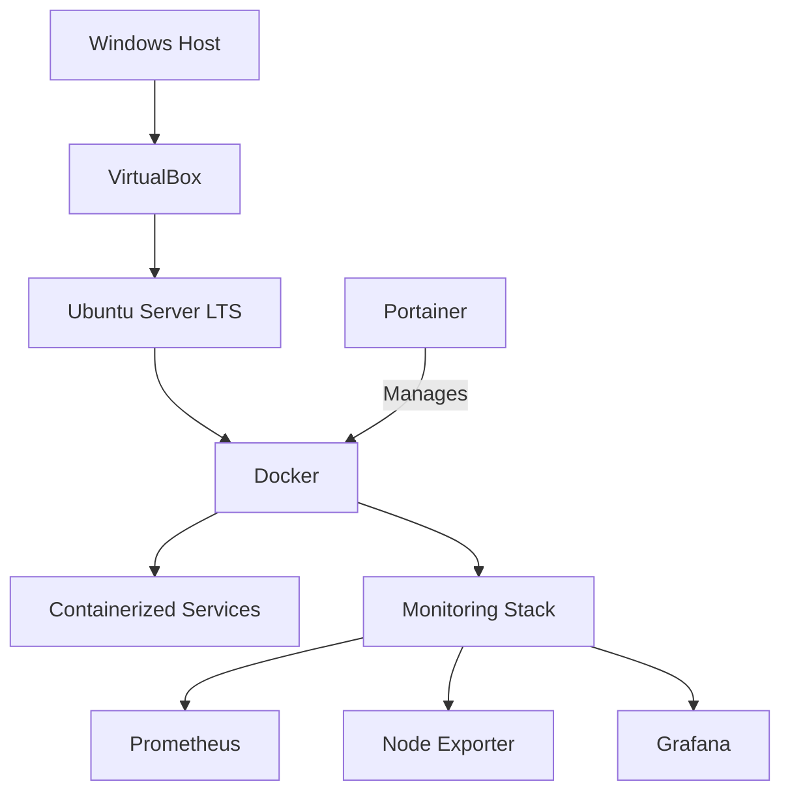
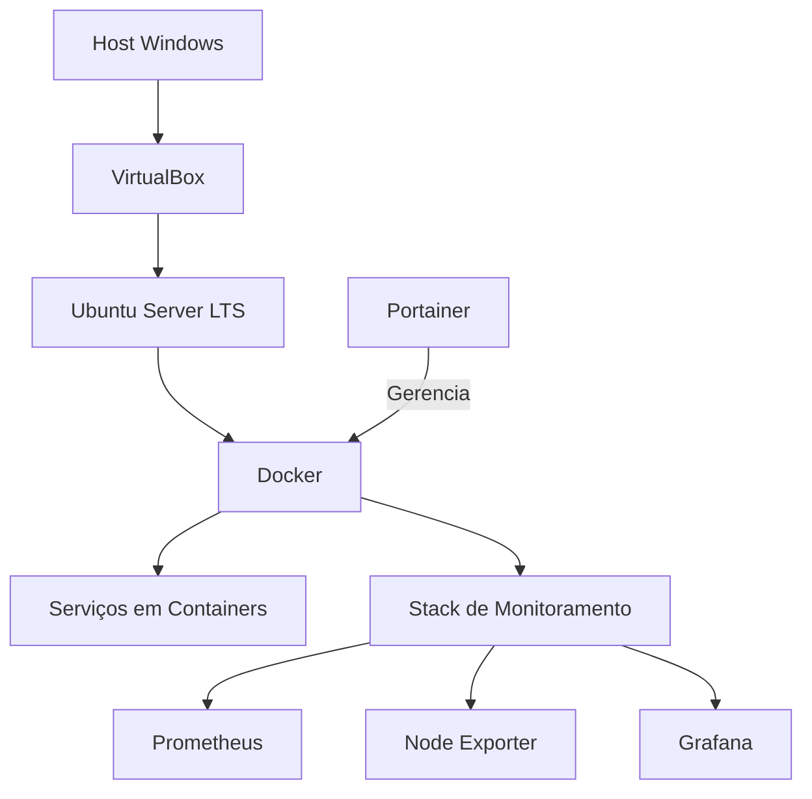

# Project Kaizen Architecture

[English](#english) | [Português](#português)

---

it# English

## Purpose

This document defines how Project Kaizen is technically organized in its current confirmed state.

It describes the system layers, confirmed components, repository structure, documentation architecture and boundaries between architectural information and other project records.

## Scope

The architecture covers:

- the Windows host;
- the virtualization layer;
- the Ubuntu Server environment;
- the container platform;
- container management;
- confirmed supporting services;
- the observability layer;
- the repository and its current documentation structure.

Planned technologies and components are not part of the current architecture until they are implemented and incorporated into the repository state.

Future evolution is maintained in [ROADMAP.md](ROADMAP.md).

## Architecture Overview

Project Kaizen uses a layered architecture in which a Windows host provides the execution environment for a virtualized Ubuntu Server.

Docker executes the containerized services, while Portainer manages the Docker environment.



## System Layers

### 1. Host Layer

**Component:** Windows Host

The Windows host provides the base operating environment in which the virtualization platform runs.

### 2. Virtualization Layer

**Component:** Oracle VirtualBox

Oracle VirtualBox hosts the virtual machine used by the Project Kaizen server environment.

### 3. Server Layer

**Component:** Ubuntu Server LTS

Ubuntu Server LTS is the guest operating system that hosts the infrastructure and container platform.

### 4. Container Platform Layer

**Component:** Docker

Docker provides the runtime used to execute containerized services.

### 5. Container Management Layer

**Component:** Portainer

Portainer provides the management interface for the Docker environment.

It manages Docker but does not replace the Docker runtime or execute containerized services independently.

### 6. Service Layer

**Component:** Containerized Services

Containerized services represent the workloads executed by Docker.

Only services confirmed in the repository belong to the current architecture.

## 7. Observability Layer

**Component:** Monitoring Stack

The observability layer provides operational visibility for the infrastructure environment.

Confirmed components:

- Prometheus;
- Node Exporter;
- Grafana.

Prometheus collects and stores infrastructure metrics.

Node Exporter provides Linux host metrics.

Grafana provides dashboards and visualization of monitoring data.

The monitoring stack is deployed using Docker Compose and operates through a dedicated Docker network.

## Confirmed Supporting Components

### Tailscale

Tailscale provides the confirmed remote-access capability associated with the Project Kaizen environment.

### Samba

Samba provides the confirmed storage and file-sharing capability of the environment.

### Git and GitHub

Git provides version control for infrastructure, documentation and scripts.

GitHub hosts the repository that represents the project's official source of truth.

## Repository Architecture

The current Project Kaizen MVP contains only the institutional documents maintained at the repository root.

```text
Project-Kaizen/
├── README.md
├── MANIFEST.md
├── PHILOSOPHY.md
├── CONSTITUTION.md
├── ARCHITECTURE.md
├── ROADMAP.md
├── CHANGELOG.md
├── LEGACY.md
├── docs/
│   ├── operations/
│   ├── architecture/
│   └── adr/
├── infrastructure/
└── scripts/
```

Directories for detailed documentation, infrastructure, services and automation will be incorporated into the architecture only when they contain real versioned assets.

### Guiding Documents

The guiding documents define the project's official direction, identity, principles, governance, architecture and planned evolution.

- [README.md](README.md)
- [MANIFEST.md](MANIFEST.md)
- [PHILOSOPHY.md](PHILOSOPHY.md)
- [CONSTITUTION.md](CONSTITUTION.md)
- [ARCHITECTURE.md](ARCHITECTURE.md)
- [ROADMAP.md](ROADMAP.md)

### Complementary Documents

The complementary documents preserve information that supports the project without defining its institutional or technical direction.

- [CHANGELOG.md](CHANGELOG.md)
- [LEGACY.md](LEGACY.md)

## Documentation Architecture

Each root document has a single primary responsibility.

| Document                           | Responsibility                                        |
| ---------------------------------- | ----------------------------------------------------- |
| [README.md](README.md)             | Project portal, quick start and navigation            |
| [MANIFEST.md](MANIFEST.md)         | Project identity, mission, vision, values and purpose |
| [PHILOSOPHY.md](PHILOSOPHY.md)     | Engineering principles and technical philosophy       |
| [CONSTITUTION.md](CONSTITUTION.md) | Mandatory rules, governance and official conventions  |
| [ARCHITECTURE.md](ARCHITECTURE.md) | Current confirmed technical organization              |
| [ROADMAP.md](ROADMAP.md)           | Planned future evolution                              |
| [CHANGELOG.md](CHANGELOG.md)       | Completed work and release history                    |
| [LEGACY.md](LEGACY.md)             | Personal and knowledge legacy                         |

Detailed content must remain in its owning document. Other documents should reference the official source instead of reproducing it.

## Source of Truth

The repository is the official single source of truth for Project Kaizen.

Within the repository:

- current technical organization belongs to [ARCHITECTURE.md](ARCHITECTURE.md);
- planned evolution belongs to [ROADMAP.md](ROADMAP.md);
- completed work and release history belong to [CHANGELOG.md](CHANGELOG.md);
- mandatory governance belongs to [CONSTITUTION.md](CONSTITUTION.md);
- engineering principles belong to [PHILOSOPHY.md](PHILOSOPHY.md);
- project identity belongs to [MANIFEST.md](MANIFEST.md).

Infrastructure, documentation and scripts evolve together when they represent the same technical change.

## Architectural Decisions

Relevant architectural decisions are preserved through Architecture Decision Records.

The governance and lifecycle of those records are defined in [CONSTITUTION.md](CONSTITUTION.md).

When ADRs are present, relevant technical documentation should reference them rather than duplicate their reasoning.

## Architecture Boundaries

This document contains only the current confirmed technical organization of Project Kaizen.

It does not contain:

- project purpose, mission, vision or values;
- engineering philosophy;
- mandatory governance rules;
- future backlog or planned phases;
- release history;
- operational procedures;
- personal legacy.

Those subjects remain in their respective official documents.

Technologies listed only as future work in [ROADMAP.md](ROADMAP.md) are outside the current architecture until their implementation is confirmed.

---

# Português

## Propósito

Este documento define como o Project Kaizen está tecnicamente organizado em seu estado atual confirmado.

Ele descreve as camadas do sistema, os componentes confirmados, a estrutura do repositório, a arquitetura da documentação e os limites entre informações arquiteturais e outros registros do projeto.

## Escopo

A arquitetura abrange:

- o host Windows;
- a camada de virtualização;
- o ambiente Ubuntu Server;
- a plataforma de containers;
- o gerenciamento de containers;
- os serviços de apoio confirmados;
- a camada de observabilidade;
- o repositório e sua estrutura documental atual.

Tecnologias e componentes planejados não fazem parte da arquitetura atual até que sejam implementados e incorporados ao estado do repositório.

A evolução futura é mantida no [ROADMAP.md](ROADMAP.md).

## Visão Geral da Arquitetura

O Project Kaizen utiliza uma arquitetura em camadas na qual um host Windows fornece o ambiente de execução para um Ubuntu Server virtualizado.

O Docker executa os serviços em containers, enquanto o Portainer gerencia o ambiente Docker.



## Camadas do Sistema

### 1. Camada de Host

**Componente:** Host Windows

O host Windows fornece o ambiente operacional base no qual a plataforma de virtualização é executada.

### 2. Camada de Virtualização

**Componente:** Oracle VirtualBox

O Oracle VirtualBox hospeda a máquina virtual utilizada pelo ambiente servidor do Project Kaizen.

### 3. Camada de Servidor

**Componente:** Ubuntu Server LTS

O Ubuntu Server LTS é o sistema operacional convidado que hospeda a infraestrutura e a plataforma de containers.

### 4. Camada da Plataforma de Containers

**Componente:** Docker

O Docker fornece o ambiente de execução utilizado para operar os serviços em containers.

### 5. Camada de Gerenciamento de Containers

**Componente:** Portainer

O Portainer fornece a interface de gerenciamento do ambiente Docker.

Ele gerencia o Docker, mas não substitui o ambiente de execução nem executa os serviços em containers de forma independente.

### 6. Camada de Serviços

**Componente:** Serviços em Containers

Os serviços em containers representam as cargas de trabalho executadas pelo Docker.

Somente serviços confirmados no repositório pertencem à arquitetura atual.

## 7. Camada de Observabilidade

**Componente:** Stack de Monitoramento

A camada de observabilidade fornece visibilidade operacional sobre o ambiente de infraestrutura.

Componentes confirmados:

- Prometheus;
- Node Exporter;
- Grafana.

O Prometheus coleta e armazena métricas da infraestrutura.

O Node Exporter fornece métricas do host Linux.

O Grafana fornece dashboards e visualização dos dados de monitoramento.

A stack de monitoramento é implantada utilizando Docker Compose e opera através de uma rede Docker dedicada.

## Componentes de Apoio Confirmados

### Tailscale

O Tailscale fornece a capacidade confirmada de acesso remoto associada ao ambiente do Project Kaizen.

### Samba

O Samba fornece a capacidade confirmada de armazenamento e compartilhamento de arquivos do ambiente.

### Git e GitHub

O Git fornece o controle de versão da infraestrutura, da documentação e dos scripts.

O GitHub hospeda o repositório que representa a fonte oficial da verdade do projeto.

## Arquitetura do Repositório

O MVP atual do Project Kaizen contém somente os documentos institucionais mantidos na raiz do repositório.

```text
Project-Kaizen/
├── README.md
├── MANIFEST.md
├── PHILOSOPHY.md
├── CONSTITUTION.md
├── ARCHITECTURE.md
├── ROADMAP.md
├── CHANGELOG.md
├── LEGACY.md
├── docs/
│   ├── operations/
│   ├── architecture/
│   └── adr/
├── infrastructure/
└── scripts/
```

Diretórios de documentação detalhada, infraestrutura, serviços e automação serão incorporados à arquitetura somente quando possuírem ativos reais versionados.

### Documentos Norteadores

Os documentos norteadores definem a direção oficial, a identidade, os princípios, a governança, a arquitetura e a evolução planejada do projeto.

- [README.md](README.md)
- [MANIFEST.md](MANIFEST.md)
- [PHILOSOPHY.md](PHILOSOPHY.md)
- [CONSTITUTION.md](CONSTITUTION.md)
- [ARCHITECTURE.md](ARCHITECTURE.md)
- [ROADMAP.md](ROADMAP.md)

### Documentos Complementares

Os documentos complementares preservam informações que apoiam o projeto sem definir sua direção institucional ou técnica.

- [CHANGELOG.md](CHANGELOG.md)
- [LEGACY.md](LEGACY.md)

## Arquitetura da Documentação

Cada documento da raiz possui uma única responsabilidade principal.

| Documento                          | Responsabilidade                                          |
| ---------------------------------- | --------------------------------------------------------- |
| [README.md](README.md)             | Portal do projeto, início rápido e navegação              |
| [MANIFEST.md](MANIFEST.md)         | Identidade, missão, visão, valores e propósito do projeto |
| [PHILOSOPHY.md](PHILOSOPHY.md)     | Princípios de engenharia e filosofia técnica              |
| [CONSTITUTION.md](CONSTITUTION.md) | Regras obrigatórias, governança e convenções oficiais     |
| [ARCHITECTURE.md](ARCHITECTURE.md) | Organização técnica atual confirmada                      |
| [ROADMAP.md](ROADMAP.md)           | Evolução futura planejada                                 |
| [CHANGELOG.md](CHANGELOG.md)       | Trabalho concluído e histórico de releases                |
| [LEGACY.md](LEGACY.md)             | Legado pessoal e de conhecimento                          |

O conteúdo detalhado deve permanecer em seu documento proprietário. Os demais documentos devem apontar para a fonte oficial em vez de reproduzi-la.

## Fonte da Verdade

O repositório é a fonte única e oficial da verdade do Project Kaizen.

Dentro do repositório:

- a organização técnica atual pertence ao [ARCHITECTURE.md](ARCHITECTURE.md);
- a evolução planejada pertence ao [ROADMAP.md](ROADMAP.md);
- o trabalho concluído e o histórico de releases pertencem ao [CHANGELOG.md](CHANGELOG.md);
- a governança obrigatória pertence ao [CONSTITUTION.md](CONSTITUTION.md);
- os princípios de engenharia pertencem ao [PHILOSOPHY.md](PHILOSOPHY.md);
- a identidade do projeto pertence ao [MANIFEST.md](MANIFEST.md).

Infraestrutura, documentação e scripts evoluem em conjunto quando representam a mesma alteração técnica.

## Decisões Arquiteturais

Decisões arquiteturais relevantes são preservadas por meio de Architecture Decision Records.

A governança e o ciclo de vida desses registros estão definidos no [CONSTITUTION.md](CONSTITUTION.md).

Quando existirem ADRs, a documentação técnica relevante deve apontar para eles em vez de duplicar suas justificativas.

## Limites da Arquitetura

Este documento contém somente a organização técnica atual confirmada do Project Kaizen.

Ele não contém:

- propósito, missão, visão ou valores do projeto;
- filosofia de engenharia;
- regras obrigatórias de governança;
- backlog futuro ou fases planejadas;
- histórico de releases;
- procedimentos operacionais;
- legado pessoal.

Esses assuntos permanecem em seus respectivos documentos oficiais.

Tecnologias listadas somente como trabalho futuro no [ROADMAP.md](ROADMAP.md) permanecem fora da arquitetura atual até que sua implementação seja confirmada.
