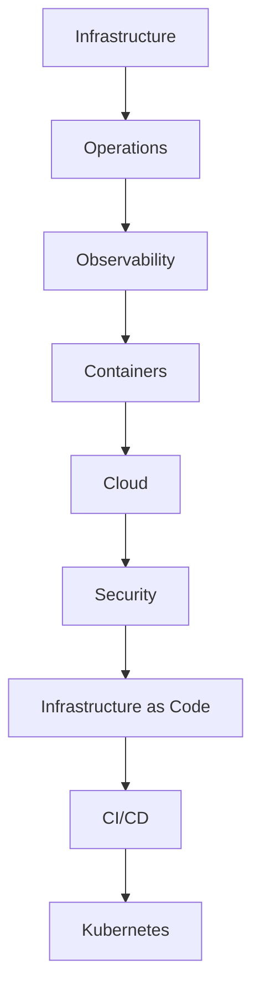
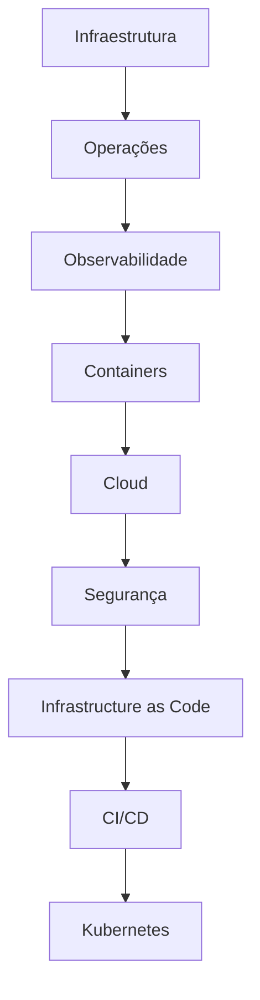

# Project Kaizen Roadmap

[English](#english) | [Português](#português)

---

# English

## Purpose

This document defines the planned evolution of Project Kaizen.

It contains only future phases, milestones and deliverables. The current technical state is documented in ARCHITECTURE.md, while completed work and release history belong to CHANGELOG.md.

## Roadmap Principles

- The Roadmap contains planned work only.
- Completed phases and releases are removed from this document and recorded in CHANGELOG.md.
- Architectural state resulting from completed work is reflected in ARCHITECTURE.md.
- Phase numbers are preserved to maintain continuity with the established project sequence.
- No phase has a fixed date unless one is formally defined.
- Each implementation cycle prioritizes practical delivery before documentation refinement.
- Sprints have a maximum duration of 5 hours. Larger initiatives are divided into multiple Sprints.

## Engineering Evolution Path

## Planned Phases

### Phase 4 — Monitoring and Observability

Planned deliverables:

- Node Exporter
- Prometheus
- Grafana
- Infrastructure metrics collection
- Operational dashboards

### Phase 5 — Container Platform Evolution

Planned deliverables:

- Docker Compose
- Container networking
- Reverse proxy
- Internal services
- Service organization improvements

### Phase 6 — Cloud Foundation

Planned deliverables:

- AWS account foundation
- IAM management
- MFA security baseline
- VPC networking concepts
- EC2 infrastructure
- S3 storage
- CloudWatch monitoring

### Phase 7 — Security Foundation

Planned deliverables:

- Linux security hardening
- SSH security improvements
- Firewall configuration
- Fail2ban protection
- Security best practices

### Phase 8 — Infrastructure as Code

Planned deliverables:

- Terraform introduction
- AWS infrastructure provisioning
- Infrastructure version control
- Reproducible environments

### Phase 9 — CI/CD Engineering

Planned deliverables:

- GitHub Actions
- Automated validation
- Infrastructure pipelines
- Automated deployment workflows

### Phase 10 — Kubernetes Foundation

Planned deliverables:

- k3s
- Container orchestration concepts
- Service discovery
- High availability concepts
- Cloud-native foundations

## Long-Term Milestone

Release:

**Project Kaizen v1.0**

Expected capabilities:

- Hybrid infrastructure knowledge
- On-premise and cloud environments
- Infrastructure automation
- Observability
- Security practices
- CI/CD workflows
- Container orchestration

## Completion Criteria

A phase is complete when:

- its listed deliverables have been implemented;
- the documentation required by CONSTITUTION.md is complete;
- the resulting technical state is reflected in ARCHITECTURE.md, when applicable;
- its completion is recorded in CHANGELOG.md.

---

# Português

## Propósito

Este documento define a evolução planejada do Project Kaizen.

Ele contém somente fases, marcos e entregas futuras. O estado técnico atual está documentado em ARCHITECTURE.md, enquanto o trabalho concluído e o histórico de releases pertencem ao CHANGELOG.md.

## Princípios do Roadmap

- O Roadmap contém somente trabalho planejado.
- Fases e releases concluídas são removidas deste documento e registradas no CHANGELOG.md.
- O estado arquitetural resultante do trabalho concluído é refletido no ARCHITECTURE.md.
- A numeração das fases é preservada para manter a continuidade com a sequência estabelecida do projeto.
- Nenhuma fase possui data fixa, exceto quando uma data for formalmente definida.
- Cada ciclo de implementação prioriza entrega prática antes do refinamento documental.
- As Sprints possuem duração máxima de 5 horas. Iniciativas maiores são divididas em múltiplas Sprints.

## Caminho de Evolução de Engenharia

## Fases Planejadas

### Fase 4 — Monitoramento e Observabilidade

Entregas planejadas:

- Node Exporter
- Prometheus
- Grafana
- Coleta de métricas da infraestrutura
- Dashboards operacionais

### Fase 5 — Evolução da Plataforma de Containers

Entregas planejadas:

- Docker Compose
- Redes de containers
- Proxy reverso
- Serviços internos
- Melhorias na organização dos serviços

### Fase 6 — Fundação Cloud

Entregas planejadas:

- Fundação da conta AWS
- Gerenciamento IAM
- MFA e baseline de segurança
- Conceitos de rede VPC
- Infraestrutura EC2
- Armazenamento S3
- Monitoramento CloudWatch

### Fase 7 — Fundação de Segurança

Entregas planejadas:

- Hardening Linux
- Melhorias de segurança SSH
- Configuração de firewall
- Proteção com Fail2ban
- Boas práticas de segurança

### Fase 8 — Infrastructure as Code

Entregas planejadas:

- Introdução ao Terraform
- Provisionamento de infraestrutura AWS
- Versionamento da infraestrutura
- Ambientes reproduzíveis

### Fase 9 — Engenharia CI/CD

Entregas planejadas:

- GitHub Actions
- Validação automatizada
- Pipelines de infraestrutura
- Fluxos de deploy automatizados

### Fase 10 — Fundação Kubernetes

Entregas planejadas:

- k3s
- Conceitos de orquestração de containers
- Descoberta de serviços
- Conceitos de alta disponibilidade
- Fundamentos Cloud Native

## Marco de Longo Prazo

Release:

**Project Kaizen v1.0**

Capacidades esperadas:

- Conhecimento de infraestrutura híbrida
- Ambientes on-premise e cloud
- Automação de infraestrutura
- Observabilidade
- Práticas de segurança
- Fluxos CI/CD
- Orquestração de containers

## Critérios de Conclusão

Uma fase está concluída quando:

- suas entregas listadas foram implementadas;
- a documentação exigida pelo CONSTITUTION.md está completa;
- o estado técnico resultante está refletido no ARCHITECTURE.md, quando aplicável;
- sua conclusão está registrada no CHANGELOG.md.
